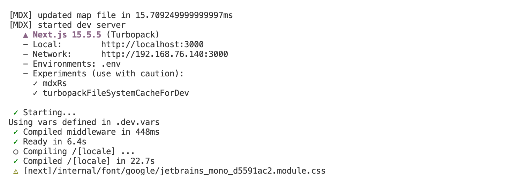

# ShipAny Template Two

## Preview

[https://cf-two.shipany.site/](https://cf-two.shipany.site/)

## Doc

[https://www.shipany.ai/zh/docs](https://www.shipany.ai/zh/docs)

## Branch

- `main`: two main branch
- `cloudfare`: two cloudfare branch
- `one/main`: one main branch
- `one/cloudfare`: one cloudfare branch
- `one/nanobanana`: one nanobanana branch [coming soon]

## 注意： 

如果你需要部署在 Cloudflare Workers，请拉取 cloudfare 分支的代码，此分支基于 Next.js 15.5.5，暂不支持 Next.js 16。【拉取后一定要重新pnpm install, 要不然启动必报错！】

## 常见问题

### .env.example中为什么配置这么少？

答：OAuth、支付、存储等配置都是通过 Admin Settings UI（/admin/settings）在数据库中管理的，而不是通过.env环境变量。 
所有OAuth、支付、存储的高级配置都通过管理界面完成：
1. 启动应用后访问 http://localhost:3000/admin/settings
2. 使用管理员账号登录
3. 在对应的标签页填写配置信息
4. 保存后配置立即生效，无需重启应用

### 官方文档为什么内容那么少？

答：作者在发版Two后发推告知：文档正在努力更新中（目录点击后大多都是占位），再等等。

### Two 与 One 有什么区别？
答：  
- Two已实现订阅续费自监听和自动发放积分功能； 
- Two内置Al图片生成器、AI 聊天机器人、Al 音乐生成器； 
- Two基础功能：后台管理系统（CMS、RBAC等）、用户中心User Console、配置话Landing Page; 
- Two支付功能：支持Stripe、Creem、Paypal三种收款渠道（Stripe已支持支付宝、微信收款方式）；

### ShipAny Two 架构要点总结 

[-> Two 架构要点总结](https://github.com/boomer1678/shipany-template/issues/1)

## Getting Started

read [ShipAny Document](https://shipany.ai/docs/quick-start) to start your AI SaaS project.

## Buy Templates

check [ShipAny Templates](https://shipany.ai/templates) to buy Business Templates.

## Feedback

submit your feedbacks on [Github Issues](https://github.com/shipanyai/shipany-template-two/issues)

## LICENSE

!!! Please do not publicly release ShipAny's Code. Illegal use will be prosecuted

[ShipAny LICENSE](./LICENSE)
