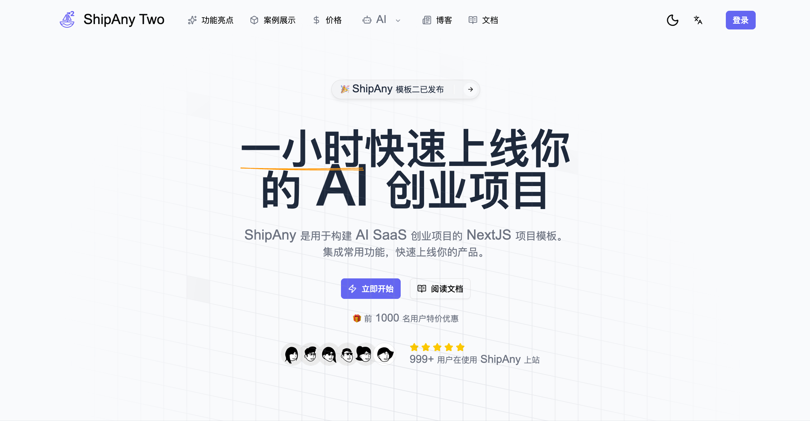

# ShipAny Template Two

## Preview

[https://cf-two.shipany.site/](https://cf-two.shipany.site/)

## Doc

[✨Shipany官方文档 作者已更新完](https://www.shipany.ai/zh/docs)

[✨Shipany按照官方文档一步步走过程记录](https://github.com/boomer1678/shipany-template/issues/2)

[✨Shipany更新日志](https://github.com/boomer1678/shipany-template/issues/3)

[✨ShipAnyTwo架构要点总结](https://github.com/boomer1678/shipany-template/issues/1)

## Branch

- `main`: two main branch
- `cloudfare`: two cloudfare branch
- `one/main`: one main branch
- `one/cloudfare`: one cloudfare branch
- `one/nanobanana`: one nanobanana branch [coming soon]

## 常见问题

### .env.example中为什么配置这么少？

答：OAuth、支付、存储等配置都是通过 Admin Settings UI（/admin/settings）在数据库中管理的，而不是通过.env环境变量。 
所有OAuth、支付、存储的高级配置都通过管理界面完成：
1. 启动应用后访问 http://localhost:3000/admin/settings
2. 使用管理员账号登录
3. 在对应的标签页填写配置信息
4. 保存后配置立即生效，无需重启应用

### 官方文档为什么内容那么少？

答：[官方文档](https://www.shipany.ai/zh/docs) 作者2025-11-24已补全所有文档，各位在开发时可以参阅，预祝各位出海发大财！

### Cloudflare分支须知

Cloudflare分支代码可以部署到Cloudflare，但是需要购买Cloudflare每月$5的套餐才能使用，否则会因为文件打包大小超过3MB而导致线上构建失败。

### Two 与 One 有什么区别？
答：  
- Two已实现订阅续费自监听和自动发放积分功能； 
- Two内置Al图片生成器、AI 聊天机器人、Al 音乐生成器； 
- Two基础功能：后台管理系统（CMS、RBAC等）、用户中心User Console、配置话Landing Page; 
- Two支付功能：支持Stripe、Creem、Paypal三种收款渠道（Stripe已支持支付宝、微信收款方式）；

## Getting Started

read [ShipAny Document](https://shipany.ai/docs/quick-start) to start your AI SaaS project.

## Buy Templates

check [ShipAny Templates](https://shipany.ai/templates) to buy Business Templates.

## Feedback

submit your feedbacks on [Github Issues](https://github.com/shipanyai/shipany-template-two/issues)

## LICENSE

!!! Please do not publicly release ShipAny's Code. Illegal use will be prosecuted

[ShipAny LICENSE](./LICENSE)
